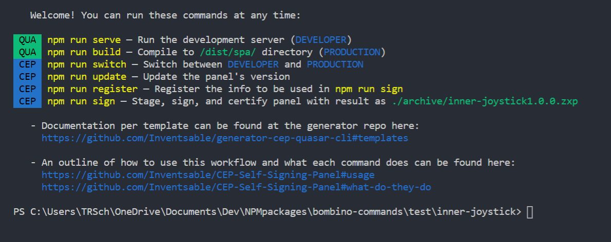

# bombino-commands

Interior panel commands for use within [bombino](https://github.com/Inventsable/bombino) panels

```bash
npm install bombino-commands

# Within root of bombino panel
npm run help
npm run switch
npm run update
# npm run sign
# npm run register

# Within root of Adobe panel if manually installed
bombino-commands help
bombino-commands switch
bombino-commands update
# bombino-commands register
# bombino-commands sign

# Additional commands
# bombino-commands typescript
# bombino-commands inject

# !!! Commented out commands are still in construction
```

## Commands (will update for bombino soon)

### `npm run help`:

- Prompt a full list of commands of the panel including description and usage



### `npm run typescript`:

- Prompts the user if they want to configure the current panel for instant Typescript support
- If yes, locate the target directory, select any apps, then automate the process of downloading the npm package and creating `tsconfig` files for you, prompting the user to manually run `tsc: watch` afterward.

### `npm run inject`:

- Prompts the user if they want to inject Adobe-specific files into the current directory, such as `/CSXS/manifest.xml`, `CSInterface.js`, or `.debug`

### `npm run sign`:

- Duplicate and "stage" an extension folder to a temporary location, removing any hidden files or folders to ensure the certificate doesn't silently fail
- Generate a temporary certificate
- Sign the duplicate with the certificate
- Check the validation of the signed duplicate
- Place the resulting `[name][version].zxp` into `./archive` of your current panel (and create this folder if it doesn't already exist). If `[name][version].zxp` already exists, overwrite it
- Delete the duplicate directory


### `npm run switch`:

> 🚩 This command only works if the panel was generated by [cep-vue-cli](https://github.com/Inventsable/generator-cep-vue-cli), [cep-quasar-cli](https://github.com/Inventsable/generator-cep-quasar-cli), or [bombino](https://github.com/Inventsable/bombino)

- Report whether the manifest is currently prepped for `PRODUCTION` or `DEVELOPER` context.
- Prompt the user if they'd like to switch contexts
- If switching contexts, automatically adjusts `manifest.xml` for you (no need to manually open it and switch every time)
- Prompt with contextual information about the next steps once the confirmation is made


### `npm run update`:

- Report the current version of the panel
- Prompt the user to update the MAJOR, MINOR, or MICRO tier
- Auto-suggest the update as the next sequential number but allow any number to be entered
- Rewrite the version number within `manifest.xml` and `package.json` with the updated semantic version


### `npm run register`:

- Report the current string of text to use for `npm run sign` certification
- Prompt the user for COUNTRY, STATE/LOCALE, ORGANIZATION, and COMMON NAME
- Write a new file (or overwrite previous) containing country, locale, organization and user

## Usage (assuming bombino default template)

When you first create the template or need to start coding, you need `npm run serve` to launch the dev server and see your code reflect in the panel. If you want to build and sign an extension, then at any time you do so by running:

- `npm run build` - This builds/compiles/gulps everything to the ./dist directory
- `npm run switch` - This changes your manifest.xml file to point to the newly created ./dist/index.html compiled in the previous step. **Without this step, the ZXP will be pointing to a localhost which doesn't exist**
- `npm run sign` - This stages, signs, and certifies the panel to create a deliverable ready for any one's use. **Note that if you want the certification info to be correct**, you must run `npm run register` at least once to fill out your own data (otherwise dummy data is used).

To continue development:

- `npm run switch` - Change the manifest.xml back to the localhost for hot reloading
- `npm run update` **[OPTIONAL]** - To avoid losing or overwriting previous code, it's a good idea to update the version after every `npm run sign`. This allows us to easily keep track of deliverables and stages, and hand off guaranteed deliverables without mixing them up.
- `npm run serve` - Restart the development server and continue coding

A one-step or odd number shift (`developer` > `production` or vice versa) requires you restart the host application. A two-step or even number shift (`developer` > `production` > `developer`) requires only that you refresh the panel. This is because `manifest.xml` only reads once at the host app's launch, so switching it's entry point to change between `production` and `developer` will not be detected by the host app.
